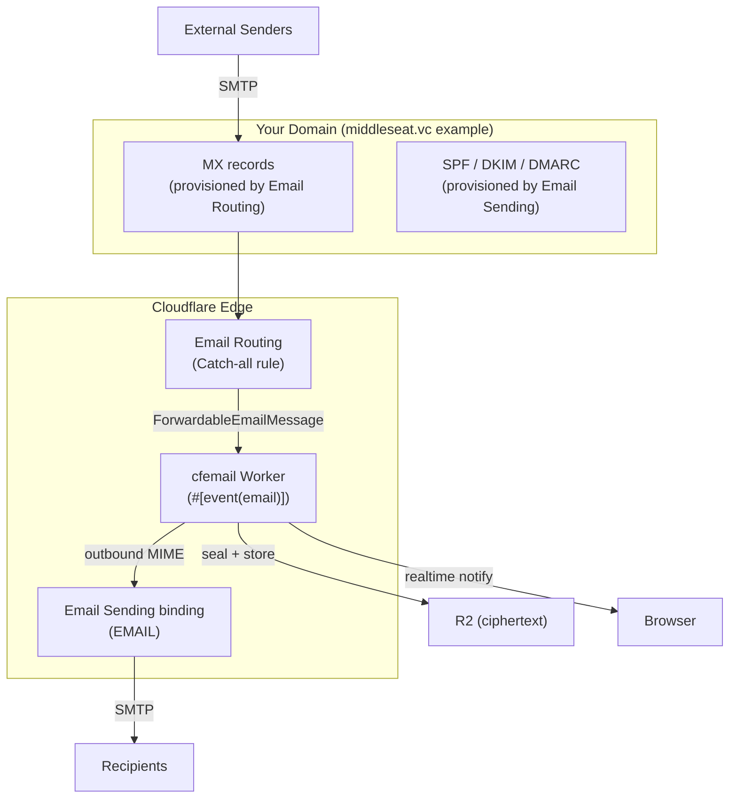

# Cloudflare Configuration Guide for bmail / cfemail

This guide documents every Cloudflare resource and setting required to run a production instance of **bmail** (the `cfemail` worker).

It expands on the "First-time setup" section in the root [README.md](../README.md) with more diagrams, verification steps, and current gotchas (as of 2026).

## 1. High-Level Email Architecture on Cloudflare



**Key points**:
- **Inbound** is handled by the `#[event(email)]` handler via Email Routing's catch-all.
- **Outbound** is handled by the `EMAIL` binding (Workers Email Sending).
- The worker name in `wrangler.jsonc` (`"name": "cfemail"`) **must** match the name you choose when you first deploy.

## 2. Prerequisites

- Cloudflare account with a domain you fully control (the email apex, e.g. `yourdomain.com`).
- Ability to change nameservers or add records if not already using Cloudflare as DNS provider.
- The worker must be deployed at least once before you can point Email Routing at it (the dashboard only shows existing Workers as targets).

## 3. Step-by-Step Configuration

### 3.1 Create the Core Resources via Wrangler (Recommended)

From the project root:

```bash
# 1. R2 bucket for ciphertext blobs + backups
npx wrangler r2 bucket create cfemail-blobs

# 2. (Optional but declared) KV namespace
npx wrangler kv namespace create CONFIG
```

Paste the returned IDs into `wrangler.jsonc` under `r2_buckets` and `kv_namespaces`.

The Durable Objects (`RegistryDO`, `MailboxDO`) are created automatically on first deploy because of the `migrations` block in `wrangler.jsonc`.

### 3.2 Attach Your Custom Domain (for the SPA + API)

In `wrangler.jsonc`:

```jsonc
"routes": [
  {
    "pattern": "mail.yourdomain.com",
    "custom_domain": true
  }
]
```

Then run:

```bash
npx wrangler deploy
```

Or let the GitHub Action do it on master.

This makes `https://mail.yourdomain.com` serve both the React SPA and all `/api/*` routes.

### 3.3 Enable Outbound Email (Email Sending)

This provisions SPF + DKIM records and gives you the `EMAIL` binding.

```bash
npx wrangler email sending enable yourdomain.com
```

- Follow the prompts. It will tell you the exact DNS records to add (or it adds them automatically if Cloudflare is your DNS provider).
- After this step, the `send_email` binding declared in `wrangler.jsonc` becomes active:

```jsonc
"send_email": [
  { "name": "EMAIL" }
]
```

In local dev, outbound is logged to the console by default. To send **real** email from `wrangler dev`, add `"remote": true`:

```jsonc
"send_email": [{ "name": "EMAIL", "remote": true }]
```

### 3.4 Enable Inbound Email (Email Routing) — The Tricky Part

```bash
npx wrangler email routing enable yourdomain.com
```

This provisions the MX records that point at Cloudflare.

**Critical step — must be done in the Dashboard**:

1. Go to: `https://dash.cloudflare.com/?to=/:account/yourdomain.com/email`
2. **Email Routing** → **Routing rules**
3. Find **Catch-all address** → **Edit**
4. Set:
   - **Action**: **Send to a Worker**
   - **Worker**: `cfemail`  (must match the name in your `wrangler.jsonc`)
5. Save and make sure the rule is **Enabled**.

> **Why the dashboard only?**  
> As of 2026, `wrangler` and the Email Routing API still have limitations around creating a true "catch-all → Worker" rule via CLI. The dashboard and the raw REST API accept it fine. This is a known upstream gap documented in the original README.

After this, every email to any address on `yourdomain.com` (and any additional domains you add later) will be delivered to the worker's `email()` handler.

### 3.5 Configure Variables (wrangler.jsonc + .dev.vars)

Required vars (see `wrangler.jsonc`):

```jsonc
"vars": {
  "PRIMARY_DOMAIN": "yourdomain.com",
  "ADDITIONAL_DOMAINS": "alt.example,other.test",   // comma-separated, can be empty
  "APP_HOST": "mail.yourdomain.com",                // WebAuthn RP ID + cookie origin
  "APP_NAME": "Your Domain Mail",
  "SESSION_TTL_DAYS": "30"
}
```

For local development create `.dev.vars` (gitignored):

```env
PRIMARY_DOMAIN=localhost
APP_HOST=localhost
ADDITIONAL_DOMAINS=
```

**Important**: `APP_HOST` must match the host the browser is connecting to, otherwise WebAuthn registration/login fails with "RP ID mismatch".

### 3.6 Cron Trigger (Automatic Backups)

Already declared in `wrangler.jsonc`:

```jsonc
"triggers": {
  "crons": ["17 3 * * *"]   // 03:17 UTC daily
}
```

This fires the `#[event(scheduled)]` handler which runs `api::admin::run_backup` + secret-link purge.

You do **not** need to do anything extra for this.

### 3.7 Observability (Recommended)

The current `wrangler.jsonc` already enables:

```jsonc
"observability": {
  "logs": { "enabled": true, "invocation_logs": true },
  "traces": { "enabled": true }
}
```

This gives you request logs and distributed tracing in the Cloudflare dashboard.

## 4. Verification Checklist

After deployment:

1. **Custom domain** — visit `https://mail.yourdomain.com` and see the landing page.
2. **Outbound** — from the UI, send a test email to an address you control. It should arrive.
3. **Inbound** — send an email from Gmail / another provider to `anything@yourdomain.com`. It should appear (encrypted) in the inbox after you log in with a passkey.
4. **DNS records** — check that MX points at Cloudflare and that SPF/DKIM are published (use `dig` or MX Toolbox).
5. **Catch-all** — confirm in the Email Routing dashboard that the catch-all rule is active and pointing at the `cfemail` Worker.

## 5. Local Development Email Behavior

| Direction     | Default behavior                          | How to send real mail locally                  |
|---------------|-------------------------------------------|------------------------------------------------|
| Outbound      | Logged to stdout by miniflare             | Add `"remote": true` to the `send_email` binding in `wrangler.jsonc` |
| Inbound       | Not possible (Cloudflare won't deliver to localhost) | Deploy to a `*.workers.dev` preview and send real mail there |

## 6. Additional Domains

If you want to handle mail for more than one domain:

1. Add them to `ADDITIONAL_DOMAINS` in `wrangler.jsonc`.
2. Run `wrangler email sending enable` and `wrangler email routing enable` for each additional zone.
3. Create the catch-all → Worker rule in the dashboard for each zone.
4. The worker's `config.owns_address()` and `canonical_address()` logic will treat them as first-class.

## 7. Common Gotchas & Troubleshooting

- **"Worker not listed in catch-all dropdown"** → You must deploy the worker at least once first (`npx wrangler deploy` or the GitHub Action).
- **WebAuthn fails on localhost** → You **must** set `APP_HOST=localhost` in `.dev.vars`.
- **Outbound mail not arriving in dev** → The binding is not in "remote" mode.
- **Catch-all not triggering** → Double-check the rule is enabled in the dashboard and that the worker name matches exactly (`cfemail`).
- **R2 permissions** → The binding name in `wrangler.jsonc` (`BLOBS`) must match the code (`env.bucket("BLOBS")`).
- **DO state reset** → Deleting `.wrangler/state/` gives you a completely fresh Registry + all mailboxes locally.

## 8. Production Hardening Recommendations

- Set an R2 lifecycle rule on the `backups/` prefix (e.g., expire after 30–90 days).
- Enable additional Email Routing rules for specific addresses if you want to forward some mail elsewhere.
- Monitor the `email_in.trackers` and error logs via Cloudflare Observability.
- Consider adding a custom DMARC policy once you have stable SPF/DKIM.
- Use separate preview environments (`wrangler deploy --env preview`) for testing major changes.

## 9. For Coding Agents

When someone asks "how do I set this up on a new domain?", point them to this document.

When modifying anything related to email delivery:

- The catch-all rule name and worker target are **not** in version control — they live in the Cloudflare dashboard per zone.
- The worker name (`cfemail`) is baked into multiple places: `wrangler.jsonc`, the AASA file in `router.rs`, and the dashboard rule. Changing it is a breaking operation.
- The `PRIMARY_DOMAIN` + `ADDITIONAL_DOMAINS` vars drive `config.owns_address()` — keep them in sync with the actual Email Routing zones.

---

**Related reading**:
- [architecture.md](./architecture.md) — where Email Routing and the `email()` handler fit in the bigger picture
- [worker.md](./worker.md) — details of the `email_in` handler
- Root [README.md](../README.md) — shorter "First-time setup" checklist

This document should be updated whenever Cloudflare changes the Email Routing or Email Sending onboarding flows.
