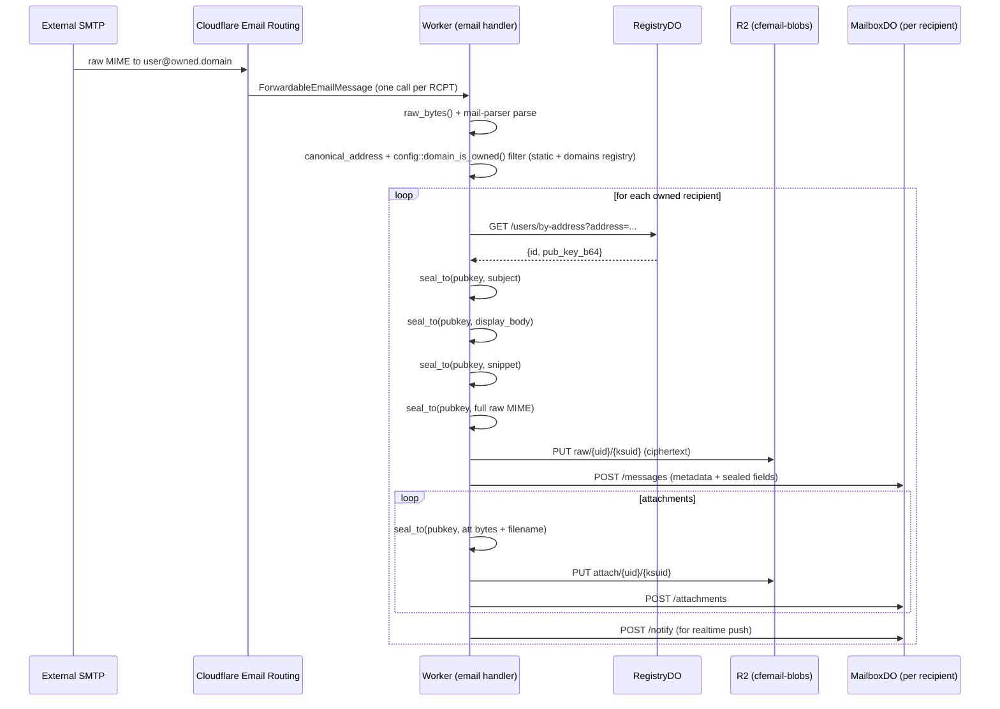

# Worker (Rust) — Detailed Design

This document is the authoritative reference for the Cloudflare Worker implementation.

**Primary entry point**: `worker/src/lib.rs`

## 1. The Three Event Handlers

```rust
// worker/src/lib.rs:26
#[event(start)]
fn start() { console_error_panic_hook::set_once(); }

#[event(fetch)]
async fn fetch(req: HttpRequest, env: Env, ctx: Context) -> Result<Response> {
    router::dispatch(req, env, ctx).await
}

#[event(email)]
async fn email(message: ForwardableEmailMessage, env: Env, ctx: Context) -> Result<()> {
    email_in::handle(message, env, ctx).await
}

#[event(scheduled)]
async fn scheduled(...) {
    api::admin::run_backup(&env).await.ok();
    api::secret::run_purge(&env).await.ok();
}
```

**For Agents**:
- `fetch` is the normal HTTP path (API + asset serving).
- `email` is the **only** way inbound mail enters the system. It is called by Cloudflare's Email Routing infrastructure, not by a browser.
- `scheduled` runs once per day (see `wrangler.jsonc` `triggers.crons`).

## 2. HTTP Router & Auth Model

All routes are declared in a giant `match` in [router.rs:32](/Users/cwong/Desktop/cfemail/worker/src/router.rs:32).

### Unauthenticated routes (by design)
- `POST /api/bootstrap`
- `POST /api/auth/*` (register options/verify, login options/verify, recovery begin/verify, logout)
- `GET /api/config`
- `GET /api/s/*` (public secret-link viewer)
- `/.well-known/apple-app-site-association`

### Everything else requires a valid session cookie

The cookie (`cfe_sid`) contains an opaque random ID. The handler calls:

```rust
let s = require_auth(&req, env).await?;   // → AuthedSession { user_id, is_admin, handle }
```

Then it obtains a stub **using only the authenticated identity**:

```rust
let stub = mailbox_stub(env, &s.user_id)?;   // id_from_name(s.user_id)
```

**INVARIANT**: No handler is allowed to accept a `user_id` from the request body or query string and use it to construct a `MailboxDO` stub without first proving ownership via the Registry.

Admin routes additionally call `require_admin_session` (which checks the `is_admin` flag stored in the user row).

## 3. The Two Durable Objects

### RegistryDO (the directory)

**File**: `worker/src/registry.rs`

**Schema highlights** (see `const SCHEMA` near the bottom of the file):
- `users`, `credentials`, `key_wraps`, `addresses`, `sessions`, `invites`, `challenges`, `secret_links`, `hosted_downloads`, `domains`

**Important tables**:
- `key_wraps` — stores the AES-GCM wrapped X25519 private key. One row per passkey + exactly one recovery row (enforced by partial unique index).
- `credentials` — stores the COSE public key and current `sign_count` (anti-cloning).
- `secret_links` — password-protected external shares (the "outside user" feature).
- `domains` — multi-tenant "bring your own domain" onboarding (one row per onboarded domain). See §3a.

All methods are behind the `fetch(&self, req)` handler of the DO (standard workers-rs pattern — no `&mut self`).

### 3a. Multi-tenant domain onboarding (`domains` table + `cf_api.rs`)

**Goal**: let an admin onboard a customer's Cloudflare domain so the customer can bring their own domain and receive sealed mail through this same worker.

**Architecture — "Path A" (the zone lives in OUR Cloudflare account)**. Cloudflare's Email Routing "send to a Worker" action only targets Workers in the *zone's own account*, so cross-account delivery into this worker is impossible. We therefore add each tenant domain as a **full zone in our account** and point its catch-all rule at this worker. All tenant zones share our account, so the single deployed worker is a valid catch-all target for every one of them.

**The one unautomatable step**: Cloudflare assigns a nameserver pair bound to the account a zone lives in, so the customer must repoint their registrar nameservers at the pair we return from zone creation. Everything before and after that is scripted.

**Components**:
- `worker/src/cf_api.rs` — `CfClient` (account-scoped REST client). `create_zone` → `get_zone` (poll for `active`) → `provision_email` (add routing DNS + enable routing + catch-all→worker + DMARC). Also `normalize_domain()` (pure, unit-tested). Auth via `CF_API_TOKEN` secret + `CF_ACCOUNT_ID` / `CF_EMAIL_WORKER_NAME` vars.
- `domains` table + DO endpoints in `registry.rs`: `POST/GET/PATCH/DELETE /domains`, `GET /domains/by-name`, `GET /domains/owns` (the fast inbound-path ownership check — only `status='active'` counts as owned).
- `worker/src/api/domains.rs` — admin endpoints: `POST /api/admin/domains` (create zone → store `pending_ns`, return nameservers), `POST /api/admin/domains/{domain}/verify` (poll zone; if active, provision + flip to `active`; idempotent), `GET /api/admin/domains`, `DELETE /api/admin/domains/{domain}` (registry soft-remove; CF zone left intact).

**INVARIANT**: inbound ownership is decided by `config::domain_is_owned(env, cfg, addr)`, which checks the static config domains first and then the `domains` registry (active only). A `pending_ns` domain does **not** accept mail. When you add a route, change the `domains` schema, or touch onboarding, update this section.

### MailboxDO (per-user mail store)

**File**: `worker/src/mailbox.rs`

**Schema** (line 1177):
- `threads`, `messages` (most fields cleartext for threading; `subject_ct`, `body_ct`, `snippet_ct` are BLOBs), `drafts`, `labels`, `message_labels`, `attachments`.

**Realtime**:
- The DO accepts WebSocket upgrades on `/realtime`.
- It sets a hibernation-safe ping/pong pair in `new()`.
- New messages trigger `POST /notify` from `email_in` or from the send path; the DO then broadcasts a small JSON envelope to all connected tabs for that user.

## 4. Inbound Email Flow (the most important sequence)



**Critical code locations**:
- Entry: `email_in::handle` → `handle_impl` ([email_in.rs:23](/Users/cwong/Desktop/cfemail/worker/src/email_in.rs:23))
- Sealing primitive: `crypto::seal_to` ([crypto.rs:17](/Users/cwong/Desktop/cfemail/worker/src/crypto.rs:17))
- HTML → text for snippet/body: `html_to_text` (same file, ~466)
- Tracker detection (ops visibility only): `count_trackers`

**For Agents**: When modifying anything in `email_in`, remember:
- The worker sees plaintext **only** for the duration of this request.
- All BLOB columns written to the MailboxDO must be pre-sealed.
- Failures after the first R2 put are best-effort (the mail is already accepted by the platform).

## 5. Cryptography Module (`crypto.rs`)

Only two public functions are used outside tests:

```rust
pub fn seal_to(pubkey: &[u8; 32], plaintext: &[u8]) -> ApiResult<Vec<u8>>
pub fn ct_eq(a: &[u8], b: &[u8]) -> bool          // constant-time
```

Everything else (HKDF info strings, nonce construction, XChaCha20-Poly1305) is private to this module and must match the client implementation in `web/src/lib/crypto.ts` exactly.

**Domain separation strings** (never change without a migration story):
- `"cfemail/sealed-box/v1"` — for message sealing
- `"cfemail/wrap-key/v1"` — for PRF → AES-GCM wrap key (client only)
- `"cfemail/prf-salt/v1\0"` + app_host — stable salt for WebAuthn PRF

## 6. Build System (the pinned horror)

Because `#[event(email)]` and correct `env`/`ctx` passing for the email handler were not in any released `workers-rs` at the time of writing, the project pins both the `worker` crate and `worker-build` to the exact same git revision (`3d0903a...` — merge of cloudflare/workers-rs#715).

The script `scripts/build-worker.sh`:
1. Installs the pinned `worker-build`.
2. Runs it.
3. Filters spurious template errors from the workers-rs checkout.
4. Post-patches the generated `shim.mjs` so that `email` is wrapped the same way `fetch` is.

**When a non-yanked release ships that contains the fix, this whole mechanism can be deleted.**

See the big comment at the top of [worker/Cargo.toml](/Users/cwong/Desktop/cfemail/worker/Cargo.toml:10) and the script itself.

## 7. Internal DO-to-DO Communication Pattern

The worker never talks directly to another DO's SQLite. Instead it uses the DO's own HTTP `fetch` interface via a stub:

```rust
let reg = registry_stub(env)?;
let user: U = stub_json(&reg, Method::Get, "/users/by-address?...", None).await?;
```

`stub_json` (in [api/mod.rs](/Users/cwong/Desktop/cfemail/worker/src/api/mod.rs:82)) builds a `Request` to a fake `https://reg/...` URL and calls `stub.fetch_with_request`.

This is the only supported way for one DO to call another in the current workers-rs model.

## 8. Error & Logging Discipline

- Most handlers convert errors via `?` into `ApiError`, which becomes a JSON body with an `error` field.
- In the `email` path, almost all errors are swallowed and only logged (`console_error!`). This is intentional — we have already accepted the message from the platform.
- Never log the plaintext of subject/body/raw in production paths.

## 9. Testing Strategy

- Worker unit tests run on the **native** target (`cargo test --lib --manifest-path worker/Cargo.toml`).
- This avoids the `wasm32` externs that would panic.
- Integration / end-to-end tests are currently manual (deploy a preview, send real mail, exercise the SPA).

## 10. Invariants & Rules for Future Changes

1. **Any struct field that deserializes a SQLite BLOB column must carry `#[serde(with = "serde_bytes")]`.**
2. When you add a BLOB column, you **must** update both the `dump_blob_table` call in `backup.rs` **and** the corresponding `load_table` column list in the same change.
3. The `email` handler must remain extremely defensive — it is the only path that can be triggered by arbitrary external input.
4. Never construct a `MailboxDO` stub from untrusted input.
5. The recovery flow must always be two steps (begin returns a sealed proof; verify checks it). Never return the recovery wrap + a usable session in one round trip.

---

**Next steps for an agent**:
- If you are touching inbound mail → re-read the entire sequence diagram above and `email_in.rs`.
- If you are changing auth → read `webauthn/` + `auth.rs` + the challenge table logic.
- If you are adding a new route → add it to the router match **and** the OpenAPI annotations in `openapi-gen/`.

See also: [architecture.md](./architecture.md) (system view) and the root [CLAUDE.md](../CLAUDE.md) (build & dev gotchas).
